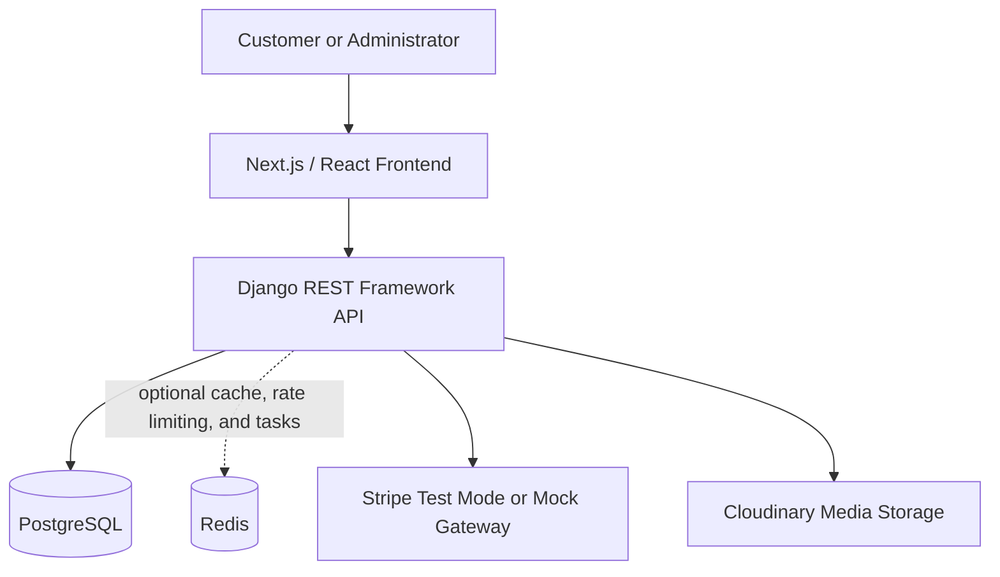
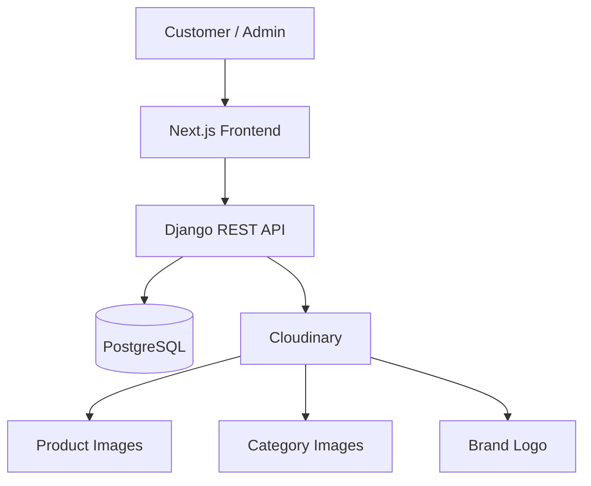

# DESIRE Scents

*A modern single-brand perfume e-commerce platform.*

## Overview

DESIRE Scents is a single-brand perfume e-commerce platform designed to provide customers with a modern digital fragrance shopping experience. The planned system supports product discovery, search, filtering, detailed product information, scent notes, concentration, shopping cart management, checkout, order processing, and inventory management.

The project is scoped as a direct-to-consumer platform: only DESIRE Scents products are sold through the system. Features described as planned or MVP scope are implementation targets and should not be interpreted as completed functionality unless the repository contains the corresponding code and tests.

## Project Objectives

1. Provide an intuitive perfume shopping experience.
2. Improve fragrance product discovery through structured catalog information.
3. Provide consistent information about scent notes, fragrance families, concentration, and category.
4. Maintain accurate product, pricing, and inventory data.
5. Provide secure, role-aware authentication.
6. Provide a reliable shopping cart workflow.
7. Support order creation and checkout.
8. Provide administrators with product, inventory, and order management capabilities.

## Key Features

| Feature | Description | Status |
|---|---|---|
| User registration and authentication | Customer account creation, login, and role-aware access to protected functions. | MVP |
| Product catalog | Product listing, search, filtering, detailed product information, and stock visibility. | MVP |
| Shopping cart | Add, update, remove, and review cart items with quantity validation. | MVP |
| Checkout and orders | Shipping information, order creation, total calculation, and Stripe test mode or mock payment processing. | MVP |
| Product and inventory administration | Authorized product, price, stock, and order management. | MVP |
| Reviews and wishlist | Customer engagement features for product feedback and saved items. | Future |
| Advanced recommendations | Personalized or AI-assisted fragrance discovery. | Future |

## User Roles

Authorization is role-based and must be enforced by the backend API.

### Customer

A customer is able to:

- Register and log in.
- Browse products.
- Search products.
- Filter products.
- View product details.
- Manage a shopping cart.
- Check out.
- View their orders.

### Administrator

An administrator is able to:

- Log in through an authorized account.
- Create products.
- Update products.
- Remove or deactivate products according to data-retention rules.
- Manage stock.
- Manage prices.
- Manage orders.

## System Architecture

The proposed system uses a layered web architecture:



- **Frontend:** Presents responsive catalog, product, cart, checkout, order, and administration interfaces.
- **Backend API:** Handles authentication, authorization, validation, catalog operations, cart rules, order creation, and administrative workflows.
- **PostgreSQL:** Stores durable users, categories, products, carts, orders, and related records.
- **Cloudinary:** Stores actual product images, category images, and the brand logo; PostgreSQL stores their URLs and metadata.
- **Redis:** Optionally supports caching, rate limiting, token/session-related data, and asynchronous work.
- **Payment gateway:** Uses Stripe test mode or a mock gateway for academic checkout demonstrations.

## Technology Stack

| Layer | Technology | Purpose |
|---|---|---|
| Frontend | Next.js / React | Responsive product browsing, routing, rendering, and customer/admin interfaces. |
| Backend | Django REST Framework | REST API, validation, permissions, business workflows, and ORM integration. |
| Language | Python | Backend application development. |
| Database | PostgreSQL | Relational persistence, transactions, foreign keys, and pricing/inventory integrity. |
| Cache | Redis | Optional caching, rate limiting, temporary data, and asynchronous processing support. |
| Image Storage | Cloudinary | Actual image files, delivery, and available media transformations. |
| Authentication | JWT | API access tokens and protected customer/admin operations. |
| Payments | Stripe Test Mode / Mock Gateway | Non-production payment workflow for the academic MVP. |
| Version Control | Git/GitHub | Source control, collaboration, review, and submission history. |

## Core E-Commerce Workflows

### 1. User Authentication

1. A customer submits registration details.
2. The backend validates the data and stores a securely hashed password.
3. The customer logs in and receives an access credential.
4. Protected API operations verify authentication and role permissions.

### 2. Product Discovery

1. The customer opens the product catalog.
2. The frontend requests products from the API.
3. The customer searches by relevant product text.
4. The customer filters by category, fragrance information, price, or availability.
5. The customer opens a product page to inspect scent notes, concentration, and stock.

### 3. Cart Management

1. The customer adds an available product to their cart.
2. The API validates the product and requested quantity.
3. The customer updates or removes cart items.
4. The cart displays quantities and the current calculated subtotal.

### 4. Checkout

1. The customer reviews the cart.
2. The customer submits shipping information.
3. The API validates stock, quantities, and totals.
4. The selected Stripe test-mode or mock payment flow is processed.
5. A confirmed order and order items are created with historical unit prices.

### 5. Order Processing

1. The system assigns an initial order status.
2. The administrator reviews orders through an authorized interface.
3. Order status can progress according to the implemented business rules.
4. The customer can view their own order history and details.

### 6. Admin Inventory Management

1. An administrator authenticates through a protected account.
2. The administrator creates or updates product information.
3. The administrator adjusts price and stock quantity.
4. Catalog availability reflects the maintained inventory data.
5. The administrator reviews related orders without exposing other administrative functions to customers.

## Product Domain

The product domain models perfume information so that customers can compare products without physically sampling them. Core attributes include:

- **Product name:** The customer-facing name.
- **Brand:** The product brand value; the platform is scoped to DESIRE Scents products.
- **Category:** A catalog grouping such as a collection or product type.
- **Fragrance family:** A high-level olfactory classification.
- **Concentration:** For example, eau de parfum or eau de toilette where applicable.
- **Gender:** A product classification used for discovery, while recognizing that fragrance preference is personal.
- **Price:** The current selling price.
- **Stock quantity:** The available inventory count.
- **Scent notes:** Structured or clearly presented fragrance notes used to describe the product.

Example fragrance-family taxonomy values include Floral, Woody, Fresh, Oriental, Citrus, and Fruity. These are product taxonomy examples, not restrictions on customer preference.

## Database Architecture

The proposed normalized relational model includes:

- **Users:** Customer and administrator identities, credentials, roles, and timestamps.
- **Categories:** Product groupings and descriptions.
- **Products:** Perfume details, category reference, price, and stock quantity.
- **Product Images:** Product image URLs, Cloudinary public IDs, alternative text, display order, and primary-image state.
- **Carts:** The active cart associated with a customer.
- **Cart Items:** Product quantities within a cart.
- **Orders:** Customer purchase records, total, status, shipping address, and creation time.
- **Order Items:** Products and quantities in an order, including a historical unit-price snapshot.

Primary keys identify records, and foreign keys enforce relationships between them. Relational integrity and transactions are important during checkout because product availability, order creation, and inventory changes must be handled consistently. The complete Sprint 1 model and Mermaid ERD are documented in [docs/SPRINT_1.md](docs/SPRINT_1.md).

## Image & Media Storage

DESIRE Scents uses Cloudinary for storing actual image assets and PostgreSQL for storing image metadata and references. Product images are represented by separate `PRODUCT_IMAGES` records so one product can have multiple images. PostgreSQL stores the Cloudinary URL, public ID, product relationship, alternative text, upload timestamp, display order, and primary-image flag. It does not store the binary image itself.

| Data | Storage |
|---|---|
| Product image file | Cloudinary |
| Product image URL | PostgreSQL |
| Cloudinary public ID | PostgreSQL |
| Image metadata | PostgreSQL |
| Category image | Cloudinary |
| Category image URL | PostgreSQL |
| Brand logo file | Cloudinary |
| Brand logo URL | PostgreSQL |

The planned media architecture is:



Cloudinary stores the actual files, including product images, category images, and the logo referenced conceptually as `desire-scents/brand/logo.png`. PostgreSQL stores the records needed to associate those assets with products or categories. The exact Cloudinary folder structure may instead be implemented with folders, tags, or public IDs.

### Image Upload and Lifecycle

The planned upload workflow is:

1. An administrator logs into the admin panel.
2. The administrator creates or edits a product and selects one or more images.
3. The frontend sends the files to the backend.
4. The backend validates file type, recommended maximum size, and content.
5. The backend uploads accepted files to Cloudinary.
6. Cloudinary returns the image URL and public ID.
7. The backend stores the URL, public ID, metadata, and `product_id` in PostgreSQL.
8. The frontend retrieves the Cloudinary URL through the API.
9. The browser requests the image from Cloudinary, which delivers it to the customer.

When an administrator deletes an image, the backend uses the stored public ID to remove the Cloudinary asset and then removes the corresponding PostgreSQL metadata record. For image replacement, the backend uploads the new image, updates the PostgreSQL record, and removes the old Cloudinary image when it is no longer referenced. Deleting only the database row could leave unused media in cloud storage.

Recommended and available Cloudinary capabilities include resizing, format conversion, compression, responsive image delivery, thumbnails, and optimized product images. These are not claims that transformations are already implemented.

Only authenticated administrators should upload media. The backend should reject unsupported formats and arbitrary executable files, validate uploaded content, and keep Cloudinary credentials in backend environment variables. JPG/JPEG, PNG, and WebP are recommended web formats, subject to the formats supported by the implementation. The Cloudinary API secret must never appear in frontend code or in a `NEXT_PUBLIC_` variable.

## Project Structure

The following is a proposed structure for the planned implementation. Directories should be treated as planned until the corresponding code is added.

```text
DESIRE-Scents/
|
|-- frontend/
|-- backend/
|-- docs/
|   `-- SPRINT_1.md
|-- assets/
|   `-- README.md
|-- .gitignore
|-- README.md
`-- LICENSE
```

## Installation & Setup

The commands below describe the expected development setup. They are implementation prerequisites, not a claim that the application is already complete.

### Frontend

```bash
cd frontend
npm install
```

### Backend

Windows PowerShell:

```powershell
cd backend
python -m venv venv
.\venv\Scripts\Activate.ps1
pip install -r requirements.txt
```

Linux/macOS:

```bash
cd backend
python3 -m venv venv
source venv/bin/activate
pip install -r requirements.txt
```

### PostgreSQL

Install PostgreSQL locally or use an approved development database. Create a database and application user with appropriate local development permissions, then set `DATABASE_URL` in the backend environment. Do not commit credentials or production connection strings.

### Redis

Install Redis locally or use a development-compatible Redis service if caching, rate limiting, or asynchronous tasks are enabled. Set `REDIS_URL` in the backend environment. Redis is optional for the earliest MVP if the implementation does not yet use those capabilities.

## Environment Variables

Use environment-specific configuration files that are excluded from version control. The following values are placeholders only:

Backend `.env` example:

```dotenv
DATABASE_URL=your_database_url_here
JWT_SECRET_KEY=your_jwt_secret_key_here
REDIS_URL=redis://localhost:6379/0
STRIPE_SECRET_KEY=your_stripe_test_secret_key_here
CLOUDINARY_CLOUD_NAME=your_cloud_name
CLOUDINARY_API_KEY=your_api_key
CLOUDINARY_API_SECRET=your_api_secret
```

Frontend `.env.local` example:

```dotenv
NEXT_PUBLIC_API_URL=http://localhost:8000/api
```

Cloudinary values belong in the backend environment configuration. Never expose `CLOUDINARY_API_SECRET` through a `NEXT_PUBLIC_` variable. Never commit real secrets, API keys, passwords, or tokens. Recommended Git ignore entries include:

```gitignore
.env
.env.*
!.env.example
```

Production product image uploads should not be committed to Git when Cloudinary is the media store. The `assets/` directory is reserved for documentation assets such as ERD exports, screenshots, and documentation diagrams.

## Running the Project

### Backend Development Server

Windows PowerShell and Linux/macOS after activating the virtual environment:

```bash
cd backend
python manage.py migrate
python manage.py runserver
```

### Frontend Development Server

```bash
cd frontend
npm run dev
```

The frontend development server normally runs at `http://localhost:3000`, and the Django development server normally runs at `http://localhost:8000`. Confirm the actual ports and API base URL in the local configuration.

### Optional Redis

Start the local Redis service using the installation's operating-system-specific command. The backend should only depend on it when Redis-backed features are enabled.

## API Overview

The following are planned API examples. Exact request and response schemas should be documented alongside the implementation.

| Method | Endpoint | Purpose |
|---|---|---|
| POST | `/api/auth/register` | Register a customer account. |
| POST | `/api/auth/login` | Authenticate a user and issue access credentials. |
| GET | `/api/products` | List, search, and filter products. |
| GET | `/api/products/{id}` | Retrieve product details. |
| POST | `/api/cart/items` | Add a product to the current cart. |
| PATCH | `/api/cart/items/{id}` | Update a cart-item quantity. |
| DELETE | `/api/cart/items/{id}` | Remove a cart item. |
| POST | `/api/orders` | Validate checkout data and create an order. |
| GET | `/api/orders` | List orders available to the authenticated customer or administrator. |
| POST | `/api/admin/products` | Create a product as an administrator. |
| PATCH | `/api/admin/products/{id}` | Update a product as an administrator. |
| DELETE | `/api/admin/products/{id}` | Remove or deactivate a product as an administrator. |

## MVP Scope

The MVP is limited to five primary workflows:

- **Authentication:** Registration, login, and role-aware access.
- **Product Catalog:** Listing, search, filtering, details, and availability.
- **Cart:** Quantity management and cart review.
- **Checkout:** Order creation and Stripe test-mode or mock payment processing.
- **Inventory Management:** Administrator product, price, stock, and order management.

The detailed scope, priorities, boundaries, and ERD are available in [docs/SPRINT_1.md](docs/SPRINT_1.md).

## Future Enhancements

The following items are future scope and are not required for the initial MVP:

- Product reviews.
- Wishlist.
- Coupons and promotional pricing.
- Loyalty program.
- AI fragrance recommendations.
- Advanced search.
- Personalized recommendations.
- Multi-currency support.
- Advanced analytics.
- Email notifications.
- SMS notifications.
- Multi-vendor support.

## Documentation

- [Sprint 1 — System Architecture & Scope Definition](docs/SPRINT_1.md)

Additional API, deployment, and testing documentation should be added as implementation decisions become stable.

## Testing

Testing is planned across the following levels and workflows:

- Unit testing for domain rules, serializers, and utility functions.
- API testing for endpoint status codes, validation, and permissions.
- Integration testing for database-backed workflows.
- Authentication testing for registration, login, token handling, and role restrictions.
- Cart testing for quantity changes, removal, and stock validation.
- Checkout testing for totals, payment outcomes, order creation, and price snapshots.
- Inventory testing for stock changes and administrator authorization.
- UI testing for catalog discovery, cart interactions, and checkout form behavior.

The repository should report actual test coverage and results only after the relevant tests are implemented and executed.

## Git Workflow

The academic collaboration workflow is:

```text
main
  |
feature branches
  |
pull request
  |
review
  |
merge
```

Example commit messages:

```text
feat: add product catalog
feat: implement cart management
fix: resolve checkout validation
docs: update sprint documentation
```

Small, focused commits and pull requests make requirements, implementation decisions, and review history easier to evaluate.

## Academic Project

DESIRE Scents is developed as an academic E-Commerce and software engineering project. It demonstrates requirements analysis, system architecture, relational database design, REST API development, authentication, e-commerce workflows, inventory management, software documentation, and version control.

The project documentation describes a feasible educational system. It does not claim production deployment, production payment processing, commercial availability, or operational guarantees unless those capabilities are separately implemented and documented.

## License

License to be determined by the project team.
# desire_scents

# desire_scents

