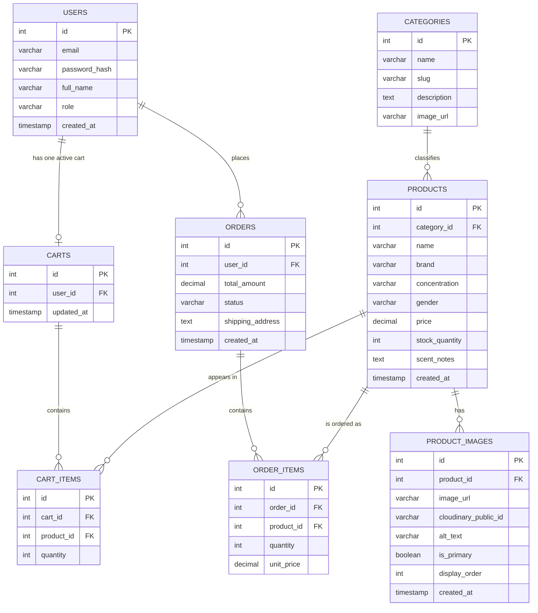

# DESIRE Scents — Perfume E-Commerce Platform Website

# SPRINT 1 — System Architecture & Scope Definition

**Course:** E-Commerce  
**Project:** **DESIRE Scents — Perfume E-Commerce Platform**  
**Repository:** `docs/SPRINT_1.md`  
**Sprint:** Sprint 1  
**Purpose:** System Architecture & Scope Definition

## 1. Introduction

Sprint 1 establishes the architectural and functional baseline for DESIRE Scents, a single-brand direct-to-consumer perfume e-commerce platform. The sprint translates the business idea into a feasible initial system scope, a proposed technology architecture, and a normalized relational data model that can guide subsequent implementation work.

The platform is intended for customers who want to discover and purchase perfumes online, and for administrators responsible for maintaining the product catalog, stock levels, prices, and orders. Its central business problem is the presentation and sale of fragrance products in a digital environment where customers cannot physically smell a product before purchase. The proposed system therefore treats structured fragrance information, product discovery, order integrity, and stock visibility as core concerns.

The system boundary includes customer-facing catalog browsing, search and filtering, authentication, cart management, checkout, order creation, and administrative product and inventory management. It does not include perfume manufacturing, delivery operations, payment processing as a financial institution, social networking, or multi-vendor commerce. The MVP philosophy is to implement a small set of complete, testable shopping workflows before adding secondary engagement and marketing capabilities.

Planning is database-first and domain-driven: the principal entities, relationships, ownership rules, and business constraints are defined before feature implementation. This approach gives later sprints a stable contract for API design, frontend screens, validation, and testing. Future sprints can build on this baseline by implementing the data model, developing REST endpoints, connecting the frontend, adding test coverage, and refining usability without changing the fundamental product scope.

## 2. Target Audience & Market Focus

### Primary Customer Persona

The primary customer is an approximately 20–45-year-old, mobile-first online shopper who is interested in perfume for personal use or gifting. This customer values clear scent descriptions, transparent pricing, accurate stock information, easy product discovery, and a reliable checkout experience. They may know the fragrance family or concentration they prefer, but may need structured product information to compare unfamiliar perfumes.

DESIRE Scents addresses several common online fragrance-shopping problems:

- Customers cannot physically smell perfume before purchasing online.
- Fragrance characteristics can be difficult to understand from generic product names alone.
- Product listings often provide insufficient information about scent notes and fragrance families.
- Customers need useful categorization such as fragrance family, concentration, gender, and size where applicable.
- Customers need reliable stock and pricing information before placing an order.

The platform responds through fragrance categories, olfactory families, scent notes, concentration and gender/category filters, price filtering, stock visibility, detailed product pages, and a simple checkout flow. These features do not reproduce an in-person sampling experience, but they provide more useful decision-making information than an unstructured product catalog.

### Administrator Persona

The administrator is an authorized member of the DESIRE Scents team who maintains the single-brand catalog and operational data. The administrator needs to create and update product information, manage prices and stock quantities, review incoming orders, and keep product availability accurate. Administrative capabilities are protected by role-based authorization and are separate from ordinary customer actions.

### Domain Scope

DESIRE Scents is a **single-brand perfume e-commerce platform**. Only DESIRE Scents products are sold through the platform.

The platform is not:

- A multi-vendor marketplace.
- A social network.
- A perfume manufacturing management system.
- A delivery company.
- A payment processor.

## 3. Minimum Viable Product (MVP) Feature Scope

The MVP contains five primary workflows. Each workflow has a deliberately limited boundary so that it can be implemented, demonstrated, and tested within an academic project.

| Category | Feature Name | Description | Priority |
|---|---|---|---|
| Authentication | User Registration & Authentication | Allow customers to register, log in, receive JWT-based access credentials, and access customer functions according to their role. MVP boundaries include account identity and authorization; social login and account recovery automation are excluded. | High (MVP) |
| Catalog | Product Listing, Search & Filtering | Display DESIRE Scents products with name, category, fragrance information, concentration, gender/category classification, price, and availability. MVP search and filtering cover practical text, category, price, and stock-related criteria rather than advanced personalization. | High (MVP) |
| Cart | Shopping Cart Management | Allow an authenticated customer to add products, change quantities, remove items, and review a current cart. MVP validation must prevent invalid quantities and should account for available stock before checkout. | High (MVP) |
| Checkout | Order Processing & Payment | Convert a valid cart into an order with order items, shipping address, total amount, and status. Payment is limited to Stripe test mode or a clearly labeled mock gateway; live financial processing is outside the academic MVP. | High (MVP) |
| Administration | Product & Inventory Management | Allow authorized administrators to create, update, and remove catalog products, manage prices and stock quantities, and review order information. Complex procurement, warehouse automation, and advanced reporting are outside the MVP. | Medium (MVP) |

### Out of Scope / Future Features

The following are future enhancements and are **not required for the Sprint 1 MVP**:

- Product reviews.
- Wishlist.
- Discount and coupon system.
- Loyalty program.
- Multi-currency support.
- Advanced recommendation engine.
- AI perfume recommendation.
- Advanced analytics.
- Multi-vendor support.
- International shipping.
- Advanced marketing automation.

## 4. Tech Stack Selection & Justification

### Frontend — Next.js / React

Next.js with React is selected for a component-based, responsive customer interface with clear routing and modern rendering options. Server-side rendering and static generation can support discoverable product pages and improve the presentation of catalog content, while Next.js image optimization is appropriate for perfume product photography. React components also support reusable catalog cards, product detail views, cart controls, checkout forms, and administrative screens.

The architecture supports a mobile-first shopping experience without preventing richer desktop layouts. Routing separates catalog, authentication, cart, checkout, order, and administration concerns. Reasonable alternatives include Vue with Nuxt or a React single-page application using Vite. Next.js is preferable here because it combines the React ecosystem with built-in routing, rendering strategies, and image handling that suit product-focused pages and a structured academic demonstration.

### Backend — Django REST Framework / Python

Django REST Framework (DRF) provides a maintainable REST API layer for authentication, product catalog operations, cart and order workflows, and administrative actions. Django ORM supports the relational model, serializers provide input and output validation, and Django's security conventions and administrative capabilities reduce the amount of infrastructure that must be built from scratch. Permissions can enforce the distinction between customers and administrators.

Node.js with Express and FastAPI are reasonable alternatives. Express is flexible but requires more decisions about ORM, validation, administration, and project structure. FastAPI offers strong API performance and type-oriented validation, but Django provides a broader integrated foundation for relational data, authentication patterns, and administrative management. DRF is therefore preferable for this project because it aligns closely with the domain model and keeps the implementation understandable for an academic software engineering submission.

### Database — PostgreSQL

PostgreSQL is selected because the platform has a strongly relational domain: users own carts and orders, categories contain products, carts contain cart items, and orders contain order items. Foreign keys, constraints, and ACID transactions help maintain order integrity and prevent inconsistent relationships. Decimal values are appropriate for monetary fields, and historical unit prices can be stored on order items so later product-price changes do not rewrite past orders.

MySQL is also a suitable relational alternative, while MongoDB could support flexible document structures. PostgreSQL is preferable because normalized relationships, referential integrity, transactional checkout, pricing precision, and inventory consistency are central to this system. A document database would make these relationships and transactional rules less direct for the defined MVP.

### Caching / Asynchronous Processing — Redis

Redis is proposed for frequently accessed, short-lived, or operational data such as cache entries, rate-limiting counters, token or session-related data, and temporary cart-related data if the implementation requires it. It can also support asynchronous jobs such as non-critical notifications or background processing when those capabilities are introduced.

Redis is optional for the earliest MVP if the application can operate correctly with PostgreSQL-backed persistence and a simple development setup. Alternatives include database-backed caching, Memcached for basic caching, or a managed queue for background work. Redis remains a useful choice because one technology can support caching, rate limiting, and task-queue integration while leaving the source of truth for products and orders in PostgreSQL.

### Authentication — JWT-Based Authentication

JWT-based authentication is suitable for a frontend and REST API that need stateless access credentials. The API can issue access tokens after login and use protected endpoints for cart, order, and administrative operations. Role claims or server-side role checks can support authorization, but authorization must be enforced by the backend rather than trusted solely from client-controlled interface state.

Cookie-based session authentication is a reasonable alternative, especially when the frontend and backend share a deployment context. JWT is selected for this architecture because it is familiar for separated frontend/API applications and demonstrates explicit API authentication boundaries. Token storage, expiration, refresh behavior, and revocation should be implemented carefully during later development.

### Payment — Stripe Test Mode or Mock Gateway

Payment handling is limited to Stripe test mode or a mock payment gateway for the academic MVP. Stripe test mode can demonstrate a realistic checkout integration without charging real funds, while a mock gateway can make the workflow deterministic for demonstrations and automated tests. In both cases, the order should only move to the appropriate payment or confirmation state after the gateway result is validated.

A real production payment deployment would require additional security, compliance, webhook handling, operational monitoring, and credential management. No production payment system is claimed by this Sprint 1 document. The selected option should be recorded clearly in implementation documentation when checkout is built.

### Image Storage — Cloudinary and PostgreSQL

Cloudinary is selected as the actual storage service for product images, category images, and the DESIRE Scents brand logo. PostgreSQL stores the image metadata and references required by the application, including Cloudinary URLs, public IDs, product relationships, alternative text, upload timestamps, display order, and the primary-image flag. The binary image files are not stored directly in PostgreSQL or committed to Git.

This separation is preferable to storing binary images in the relational database because Cloudinary is designed to deliver media and can provide recommended capabilities such as resizing, format conversion, compression, responsive delivery, and thumbnails. PostgreSQL remains the source of truth for the relationships and metadata used by the catalog API. The exact Cloudinary folder structure may be represented through folders, tags, or public IDs.

The planned logical organization is:

```text
desire-scents/
|-- products/
|   |-- desire-noir/
|   |   |-- main.jpg
|   |   `-- side.jpg
|   |-- desire-rose/
|   |   `-- main.jpg
|   `-- desire-oud/
|       `-- main.jpg
|-- categories/
|   |-- floral.jpg
|   |-- woody.jpg
|   `-- fresh.jpg
`-- brand/
    `-- logo.png
```

The structure is illustrative and does not claim that Cloudinary is already configured. Only authenticated administrators should upload images. The backend should validate file type, recommended maximum size, and content, reject unsupported or executable files, keep Cloudinary credentials in backend environment variables, and never expose API secrets in frontend code or commit them to Git. JPG/JPEG, PNG, and WebP are recommended web formats, subject to the formats supported by the eventual implementation.

## 5. Entity-Relationship Diagram (ERD)

The following ERD defines the minimum relational model for the MVP. Primary keys are marked `PK`, foreign keys are marked `FK`, and explicit SQL-compatible data types are included. The `unit_price` on `ORDER_ITEMS` preserves the price used at the time of ordering, even if the current product price changes later. Cloudinary stores actual image files; PostgreSQL stores image metadata and references.



### ERD Design Notes

- Every foreign key points to an existing primary key: `PRODUCTS.category_id` to `CATEGORIES.id`, `CARTS.user_id` to `USERS.id`, `CART_ITEMS.cart_id` to `CARTS.id`, `CART_ITEMS.product_id` to `PRODUCTS.id`, `ORDERS.user_id` to `USERS.id`, and the two `ORDER_ITEMS` foreign keys to `ORDERS.id` and `PRODUCTS.id`.
- `PRODUCT_IMAGES.product_id` points to `PRODUCTS.id`, allowing one perfume to have multiple images such as a main bottle image, side image, packaging image, or lifestyle image. Each image record belongs to exactly one product.
- `CATEGORIES.image_url` is a single Cloudinary reference for the MVP because each category currently needs at most one image. The URL points to Cloudinary; the binary file is not stored in PostgreSQL.
- The one-to-many relationships allow one user to place multiple orders, one category to classify multiple products, one cart to contain multiple products through `CART_ITEMS`, and one order to contain multiple products through `ORDER_ITEMS`.
- The many-to-many relationship between orders and products is resolved through `ORDER_ITEMS`, which also stores quantity and historical `unit_price`.
- A user may have no cart before shopping, but can have at most one active cart. The implementation should enforce this with a unique constraint on `CARTS.user_id`.
- The implementation should also consider unique constraints for `USERS.email`, `CATEGORIES.slug`, and the pair `CART_ITEMS(cart_id, product_id)` so duplicate logical records are avoided.
- Product deletion should be constrained or handled deliberately because existing cart and order records may refer to that product. Historical orders should remain auditable.

### Image Upload, Update, and Deletion Workflows

The planned image workflow is:

1. An administrator logs into the admin panel and creates or edits a product.
2. The administrator selects one or more product images.
3. The frontend sends the files to the backend.
4. The backend validates the file type, size configuration, and content.
5. The backend uploads each accepted file to Cloudinary.
6. Cloudinary returns a URL and public ID.
7. The backend stores the URL, public ID, product relationship, alternative text, display order, and primary-image flag in PostgreSQL.
8. The frontend retrieves the Cloudinary URL through the API, and the customer receives the optimized image from Cloudinary.

The database does not contain the binary image itself. When an administrator deletes an image, the backend first identifies its Cloudinary public ID and removes the Cloudinary asset, then removes the corresponding PostgreSQL metadata record. Deleting only the database row could leave an unused asset in cloud storage. For replacement, the backend uploads the new image, updates the PostgreSQL record with the new URL and public ID, and removes the old Cloudinary asset after confirming it is no longer referenced.

### Image Architecture

```text
Customer/Admin
    |
Next.js Frontend
    |
Django REST API
    |----------------------> Cloudinary
    |                         actual image files
    v
PostgreSQL
image metadata, URLs, and public IDs
```

Cloudinary credentials belong in backend environment variables. The API secret must never be exposed through a `NEXT_PUBLIC_` variable or frontend code. These upload, update, and deletion workflows are planned behavior and are not claims that media handling is already implemented.

## 6. Evaluation Alignment

| Criterion | Weight | How This Document Satisfies It |
|---|---:|---|
| Architecture Clarity | 30% | Defines the single-brand domain, system boundaries, user roles, technology layers, MVP workflows, and responsibilities of the frontend, API, database, cache, authentication, and payment components. |
| ERD Completeness & Validity | 40% | Includes all required entities, explicit SQL-compatible types, primary and foreign keys, relationship cardinalities, normalized junction tables, and historical order pricing. |
| Scope Feasibility | 20% | Limits the MVP to five demonstrable workflows and clearly separates future enhancements from Sprint 1 requirements. |
| Documentation Quality | 10% | Provides consistent terminology, professional Markdown structure, implementation assumptions, repository guidance, and a submission checklist suitable for academic review. |

## 7. Repository & Submission Checklist

- [ ] GitHub repository created.
- [ ] `README.md` added at the repository root.
- [ ] `docs/SPRINT_1.md` added.
- [ ] Mermaid ERD included and rendered correctly in the repository viewer.
- [ ] `assets/` directory created if product or documentation assets are required.
- [ ] Code repository organized into clearly named frontend, backend, and documentation areas.
- [ ] Instructor or teaching-assistant access configured if required.
- [ ] Primary branch contains the final documentation.
- [ ] Repository URL submitted to the LMS.
